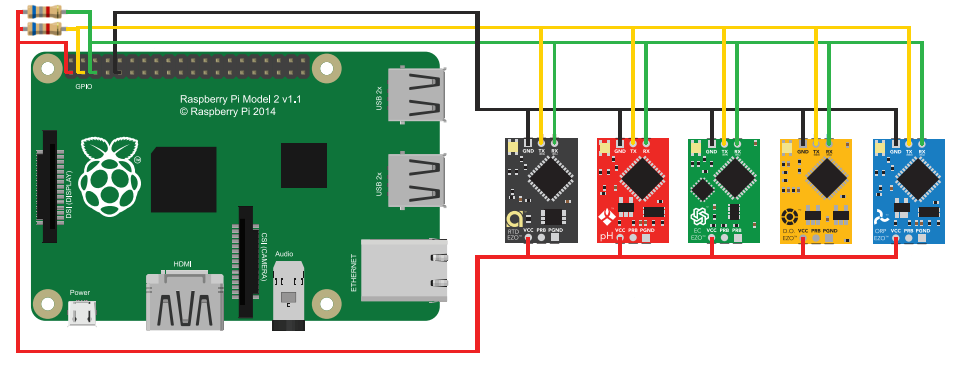

# atlas-ros

ROS node for [Atlas Scientific's water quality sensor kit](https://www.atlas-scientific.com/product_pages/kits/env-sds-kit.html). Tested and working in [ROS Kinetic](http://wiki.ros.org/kinetic).

## Installation

After [installing ROS](http://wiki.ros.org/kinetic/Installation) and [building the Catkin workspace](http://wiki.ros.org/ROS/Tutorials/InstallingandConfiguringROSEnvironment#Create_a_ROS_Workspace), simply clone this repository and install via Catkin:

```
    cd ~/catkin_ws/src
    git clone https://github.com/disaster-robotics-proalertas/atlas-ros
    cd .. && catkin_make clean && catkin_make install
```

If using a Raspberry Pi with Raspbian and ROS installed (following [this guide](http://wiki.ros.org/ROSberryPi/Installing%20ROS%20Kinetic%20on%20the%20Raspberry%20Pi), see __Usage__ section below), installing the package is recommended with the "catkin_make_isolated" command. Log into the Raspberry with [SSH](https://www.openssh.com/) and enter the following:

```
    cd ~/ros_catkin_ws
    sudo ./src/catkin/bin/catkin_make_isolated --install --install-space /opt/ros/kinetic --pkg atlas_ros
```

The __sudo__ authentication is necessary to write the install files to "/opt/ros/kinetic" so ROS can see them, as the "catkin_make_isolated" command does not produce a setup script to set ROS' environmental variables. Alternatively, you can point the environmental variables (mainly __ROS_PACKAGE_PATH__) directly to the install folder of your choosing.

## Usage

Currently, the sensor modules are mounted on a prototype board along with the Serial Expander, which communicates to a [Raspberry Pi Zero](https://www.raspberrypi.org/products/raspberry-pi-zero/) (RPi). Although the package should work with any computer with a UART interface, setting up the sensors along with the RPi is strongly recommended. The wiring for this particular case can be seen [below](./rpi-protoboard-wiring.png) (the Raspberry Pi 2 and Zero share the same GPIO pinout).



* To configure RPi's UART communication, see [Atlas' guide in UART communication](https://www.atlas-scientific.com/_files/code/pi_sample_code.pdf).
* To install ROS in your RPi, see [ROS Raspbian install instructions](http://wiki.ros.org/ROSberryPi/Installing%20ROS%20Kinetic%20on%20the%20Raspberry%20Pi).

The ROS package contains one node, __sensors.py__, which communicates with the Serial Expander, switches the expander's ports, and reads the sensors one at a time, publishing their data in custom message ROS topics.
To run the node, first run a ROS core, and then use the __rosrun__ command:

```
    roscore && rosrun atlas_ros sensors.py
```

The package contains a launch file as well, where several parameters of the node can be set, namely:

* Publishing rate (Hz)
* Sensor topic names
* Sensor expander ports (i.e., the Serial Expander port to which the sensors are connected)

To use the launch file, in your RPi, copy "__sensors.launch__" from the "launch" folder to ROS' package install directory:

```
    sudo cp ~/ros_catkin_ws/src/atlas_ros/launch/sensors.launch /opt/ros/kinetic/share/atlas_ros/launch
```

To run, use the __roslaunch__ command (a core will be automatically run if none is active):

```
    roslaunch atlas_ros sensors.launch
```

This file also automatically starts a [ROSBAG](http://wiki.ros.org/rosbag) recording of all topics. To disable this, comment the rosbag node line from the launch file in "/opt/ros/kinetic/share/atlas_ros/launch/sensors.launch".

### ROS Network setup

If using the RPi setup described above, it is highly recommended to set the RPi to be a __master__ in the ROS network.
This allows for other computers to seamlessly access the RPi's topics, parameters and node information.
To do this, follow [this](http://wiki.ros.org/ROS/NetworkSetup) tutorial, changing the __ROS_MASTER_URI__ and __ROS_HOSTNAME__ appropriately on the RPi and other computers in the ROS network.

### GPS dependency

By default, the data from the sensors are published with a __GPS Time__ (GPST) information, and thus the __sensors.py__ node requires a GPST source, typically provided in ROS with the [TimeReference](http://docs.ros.org/jade/api/sensor_msgs/html/msg/TimeReference.html) message. This message usually comes from GPS sensors (e.g., with the [nmea_navsat_driver](http://wiki.ros.org/nmea_navsat_driver) package) in the ROS network, although it can be artificially published (for testing purposes) as:

```
    rostopic pub -r 1 /time_reference sensor_msgs/TimeReference '{time_ref: 1, source: gps}'
```

__Future work__: Add a parameter to switch this dependency on and off

## Contributors

* [Renan Maidana](https://github.com/rgmaidana)
* [Guilherme Heck](https://dblp.uni-trier.de/pers/hd/h/Heck:Guilherme)
* [Alexandre Amory](https://github.com/amamory)
